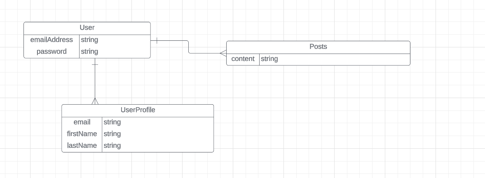

 # Connect
 This is the API of my connect app. This API was designed to hold all the users on this website as well all of their posts.
 
### Table of Contents
- Tools and Technology

- Overview

- User Stories

- ERD Diagram

- Planning

- Dependencies

- Wins and Hurdles

- Credits

###   Tools and Technology
Spring Boot Rest API

Visual Studio Code

IntelliJ

Angular

Bootstrap

Postman

### Overview
This project is one that is meant to be a website that allows people to connect thoughts with each other,
Hence the word connect. This was made so that people can truly connect on with each other on a mental foundation.

### User Stories
As a user I should be able to create an account.

As a user I should be able to login to my account.

As a user I should be able to create a post.

As a user I should be able to update a post.

As a user I should be able to get a post.

As a user I should be able to delete a post.

### ERD Diagram

### Planning
[Github Project](https://github.com/users/ObinnaUmerah/projects/7/views/1)

### Dependencies
<dependencies>
		<dependency>
			<groupId>org.springframework.boot</groupId>
			<artifactId>spring-boot-starter-data-rest</artifactId>
		</dependency>
		<dependency>
			<groupId>org.springframework.boot</groupId>
			<artifactId>spring-boot-devtools</artifactId>
			<scope>runtime</scope>
			<optional>true</optional>
		</dependency>
		<dependency>
			<groupId>com.h2database</groupId>
			<artifactId>h2</artifactId>
			<scope>runtime</scope>
		</dependency>
		<dependency>
			<groupId>org.springframework.boot</groupId>
			<artifactId>spring-boot-starter-jdbc</artifactId>
		</dependency>
		<dependency>
			<groupId>org.springframework.boot</groupId>
			<artifactId>spring-boot-starter-test</artifactId>
			<scope>test</scope>
		</dependency>
		<dependency>
			<groupId>org.springframework.boot</groupId>
			<artifactId>spring-boot-starter-data-jpa</artifactId>
		</dependency>
		<dependency>
			<groupId>junit</groupId>
			<artifactId>junit</artifactId>
			<scope>test</scope>
		</dependency>
		<dependency>
			<groupId>io.cucumber</groupId>
			<artifactId>cucumber-java</artifactId>
			<version>${cucumber.version}</version>
			<scope>test</scope>
		</dependency>
		<dependency>
			<groupId>io.cucumber</groupId>
			<artifactId>cucumber-junit</artifactId>
			<version>${cucumber.version}</version>
			<scope>test</scope>
		</dependency>
		<dependency>
			<groupId>io.cucumber</groupId>
			<artifactId>cucumber-spring</artifactId>
			<version>${cucumber.version}</version>
			<scope>test</scope>
		</dependency>
		<dependency>
			<groupId>io.rest-assured</groupId>
			<artifactId>rest-assured</artifactId>
			<version>4.3.0</version>
			<scope>test</scope>
		</dependency>
		<dependency>
			<groupId>org.springframework.boot</groupId>
			<artifactId>spring-boot-starter</artifactId>
		</dependency>

		<dependency>
			<groupId>org.springframework.boot</groupId>
			<artifactId>spring-boot-starter-test</artifactId>
			<scope>test</scope>
		</dependency>
		<dependency>
			<groupId>org.springframework.boot</groupId>
			<artifactId>spring-boot-starter-web</artifactId>
		</dependency>
		<dependency>
			<groupId>org.springframework.boot</groupId>
			<artifactId>spring-boot-starter-data-jpa</artifactId>
		</dependency>
		<dependency>
			<groupId>org.springframework.boot</groupId>
			<artifactId>spring-boot-devtools</artifactId>
			<scope>runtime</scope>
			<optional>true</optional>
		</dependency>
		<dependency>
			<groupId>com.h2database</groupId>
			<artifactId>h2</artifactId>
			<scope>runtime</scope>
		</dependency>
		<dependency>
			<groupId>org.springframework.boot</groupId>
			<artifactId>spring-boot-starter-jdbc</artifactId>
		</dependency>
		<dependency>
			<groupId>junit</groupId>
			<artifactId>junit</artifactId>
			<scope>test</scope>
		</dependency>
		<dependency>
			<groupId>io.cucumber</groupId>
			<artifactId>cucumber-java</artifactId>
			<version>${cucumber.version}</version>
			<scope>test</scope>
		</dependency>
		<dependency>
			<groupId>io.cucumber</groupId>
			<artifactId>cucumber-junit</artifactId>
			<version>${cucumber.version}</version>
			<scope>test</scope>
		</dependency>
		<dependency>
			<groupId>io.cucumber</groupId>
			<artifactId>cucumber-spring</artifactId>
			<version>${cucumber.version}</version>
			<scope>test</scope>
		</dependency>
		<dependency>
			<groupId>io.rest-assured</groupId>
			<artifactId>rest-assured</artifactId>
			<version>4.3.0</version>
			<scope>test</scope>
		</dependency>
		<dependency>
			<groupId>org.springframework.boot</groupId>
			<artifactId>spring-boot-starter-security</artifactId>
			<version>3.0.5</version>
		</dependency>
		<dependency>
			<groupId>io.jsonwebtoken</groupId>
			<artifactId>jjwt-api</artifactId>
			<version>0.11.5</version>
		</dependency>
		</dependency>
</dependencies>

### Wins and Hurdles
I learned the basics of how to create a full stack application which was a first for me. Also the jwt portion of this
project gave me some issues that took some time. One thing I would change would be to not include in the jwt key until
everything else was implemented. This severely hindered my progress as I tried to make this the central point of my
project.

### Credits
I would like to thank [Lorena Rojas](https://github.com/lrojas4), [Maksym Zinchenko](https://github.com/maklaut007),
[Leonardo Rodriguez](https://github.com/LRodriguez92), [Suresh Sigera](https://github.com/sureshmelvinsigera/) for 
helping me with the work that I was able to complete on this iteration.

